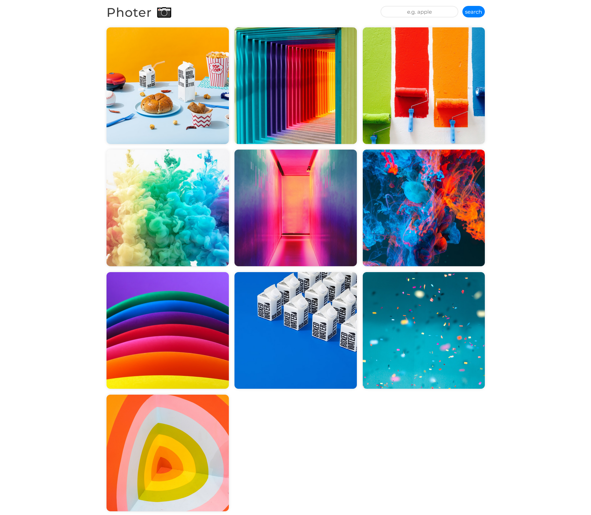

# Photer

### [Go Live](https://tadrochlinski.github.io/photer/)

## Overview
### Instalation
To Start Server:

`npm start`  

To Visit App:

`localhost:3000`

### Screenshot

### Built with

- RWD / Mobile first
- JS
- React
- React Router
- Unsplash API
- CSS / Styled Components

### Reflections
This app helped me a lot to understand better developing in react. I used Unsplash API to create photo search app and i learned how to use Styled Components and React Router. 
